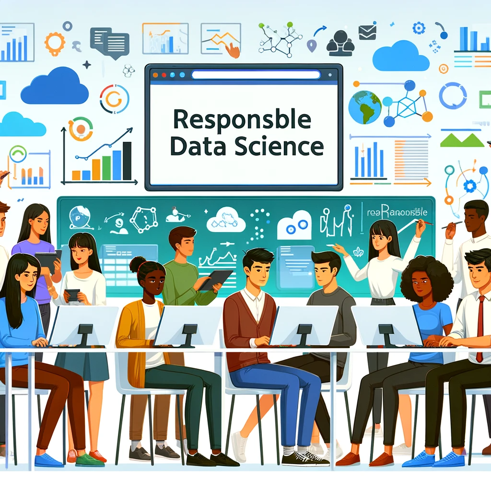

# DSC 261: Responsible Data Science 

## Description:

This course delves into Responsible Data Science, emphasizing the importance of conscientious practices in data analysis and application. It commences with Causal Inference, enabling students to distinguish between correlation and causation for accurate data interpretation. Subsequent modules cover Algorithmic Fairness to promote unbiased AI development, and Explainable AI, which aims to enhance the transparency and reliability of AI outputs. The curriculum concludes with Data Cleaning, Profiling, and Debiasing, where students learn to refine data quality and mitigate inherent biases. The course is tailored for those seeking to apply data science principles responsibly in practical scenarios.

## Instructional team:

**Instructor:**

[Babak Salimi](https://bsalimi.github.io/), bsalimi@ucsd.edu

**Course Assistants:**

Jiongli Zhu, [jiz143@ucsd.edu](mailto:jiz143@ucsd.edu)   

Parjanya Prashant, [pprashant@ucsd.edu](mailto:pprashant@ucsd.edu)  

**Lectures**:

Tuesdays and Thursdays at	3:00pm-4:20pm

**Office Hours:**
TBD

**Note:** Office hours will be held via Zoom (link can be found on the Canvas calendar). 

### Course Workload

In this course, students will engage in a **project-based and presentation learning experience**, emphasizing teamwork, practical application of data science techniques, and effective communication. Groups of 5-6 students will collaborate to develop projects on topics relevant to the class.  
**Team formation**: Team formation details will be announced by the TA via a Google Doc.

#### Paper Presentation (Mid-Quarter)
- **Each team will present 2-3 related papers in one domain.** 
- The presentation will be **20 minutes**, followed by a **10-minute discussion**. 
- Presentation topics will be selected by the teams, and details will be announced by the TA.

- **Depth of Analysis (40%)** – Understanding, critique, and synthesis of the papers.
- **Clarity & Organization (30%)** – Clear structure, effective visuals, and presentation.
- **Discussion Engagement (20%)** – Thoughtful questions and interaction with the audience.
- **Team Collaboration (10%)** – Equal contribution from all members.

#### Project Requirements:
Each project must:

- **Present a clearly defined hypothesis** and contribute in at least one of the following areas:
   - Propose a novel theory or algorithm.
   - Apply an existing approach to a new domain.
   - Reimplement a paper where no public code is available.

- **Experiments** should be rigorously designed, with well-defined, measurable metrics. All results must include error bars.
   - For theory-focused projects, formal proofs are required.

#### Grading for Projects:
Grading will be based on:

- **Contribution and Effort**
- **Writing**
- **Execution**

**Note on Results:** Projects with thoughtfully designed experiments and solid execution will **not be penalized for yielding negative results**.

#### Checkpoints:
The course will have three project checkpoints:
1. **Initial Proposal**
2. **Midterm Update**
3. **Final Report**

Students are encouraged to meet with the instructor team regularly for guidance. The project will culminate in a short in-class presentation, where students will also create visual posters and dynamic presentations.

#### Grading for Projects: 
Evaluation will consider:
1. **Team Effort**
2. **Quality of Related Work Survey**
3. **Effectiveness of Presentation**
4. **Final Report**
5. **Peer Reviews** (constructive feedback from and to peers)

## Project Timeline

### Week 1: Project Kickoff
- **Activities**: Introduction to course and project guidelines. Begin forming teams.

### Week 2: Team Formation and Topic Selection
- **Activities**: Finalize teams [here](https://forms.gle/Cwzqtrn5reG9K2pt8). Select project topics and submit initial ideas for approval.

### Week 3: Project Proposal Development
- **Activities**: Develop and refine project proposals. Closely work with TAs for brainstorming. Outline objectives, methodologies, and expected outcomes.

### Week 4: Proposal Submission and Feedback
- **Activities**: Submit detailed project proposals. Receive feedback from the TAs and make necessary adjustments.

### Week 5-8: Project Execution Begins
- **Activities**: Start executing the project according to the plan. Focus on data collection and initial analysis.

### Week 9-10: Project Presentation
- **Activities**: Finalize project outcomes. Prepare demonstration models and poster presentations.

### Grading Breakdown

- **Paper Presentation**: 30%
- **Project Proposal**: 10%
- **Execution**: 30%
- **Demonstration**: 10%
- **Project Presentation**: 10%
- **Class Participation**: 10%

## **Calender:**

**(subject to change)**

# Course Calendar: 

| Week | Date | Lecture Topics | Slides | Readings |
|------|------|----------------|--------|----------|
| 1    |      |                |        |          |
| 2    |      |                |        |          |
| 3    |      |                |        |          |
| 4    |      |                |        |          |
| 5    |      |                |        |          |
| 6    |      |                |        |          |
| 7    |      |                |        |          |
| 8    |      |                |        |          |
| 9    |      |                |        |          |
| 10   |      |                |        |          |
       

**Note**: The readings and slides are placeholders and should be replaced with actual links to resources.

## Textbook

[Causal Inference in Statistics: A Primer
](http://bayes.cs.ucla.edu/PRIMER/) 

[Trustworthy Machine Learning](http://www.trustworthymachinelearning.com/)

[Fairness and Machine Learning: Limitations and Opportunities](https://fairmlbook.org/)

[Interpretable Machine Learning
A Guide for Making Black Box Models Explainable](https://christophm.github.io/interpretable-ml-book/)

